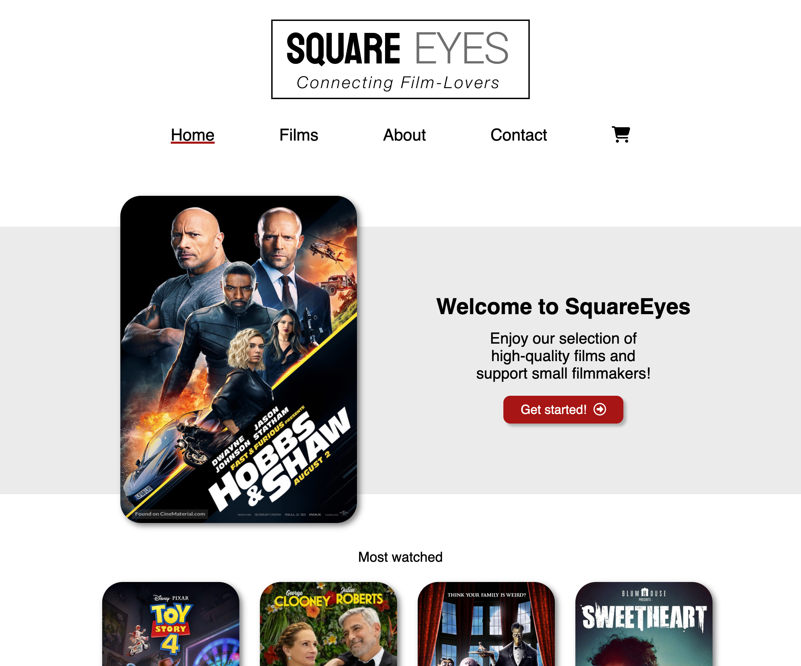

# SquareEyes



[SquareEyes](https://cv-square-eyes.netlify.app/) is a fictional filmstreaming website that I worked on during my first year of Front-End Development at Noroff.

## Description

SquareEyes is a cross-course project that I worked on during my first year of Front-End Development at Noroff. It began with creating a design and wireframes in Figma, followed by building a fully responsive website using HTML and CSS. Additionally, JavaScript was incorporated to enhance interactivity, and content was fetched from a WordPress/WooCommerce REST API.

- Fully responsive
- Wordpress Rest API
- Vanilla JavaScript

## Built With

- HTML & CSS
- JavaScript

## Getting Started

### Installing

1. Clone the repo:

```bash
git clone https://github.com/Noroff-FEU-Assignments/cross-course-project-CharlotteValset.git
```

2. Install the dependencies:

```
npm install
```

### Running

To run the app, run the following commands:

```bash
npm run start
```

## Contributing

If you'd like to get involved in the project, please consider one of the following options:

- Submit a Pull Request:
  If you've made modifications or enhancements to the codebase, it is encouraged that you initiate a pull request (PR).

- Report an Issue:
  Should you encounter an issue or have a feature request, don't hesitate to create an issue. Please describe the problem or the enhancement you have in mind in as much detail as possible. This will assist me in tracking and prioritizing community input.

## Contact

Please contact me through:

[My Portfolio page](https://charlottevalset.no/portfolio/)

[My LinkedIn page](https://www.linkedin.com/in/charlotte-valset-6195b521a/)

## Acknowledgments

I would like to ackowledge my mentor, Eric Pretzinger - for guiding me and making me a better Front-End Developer.
